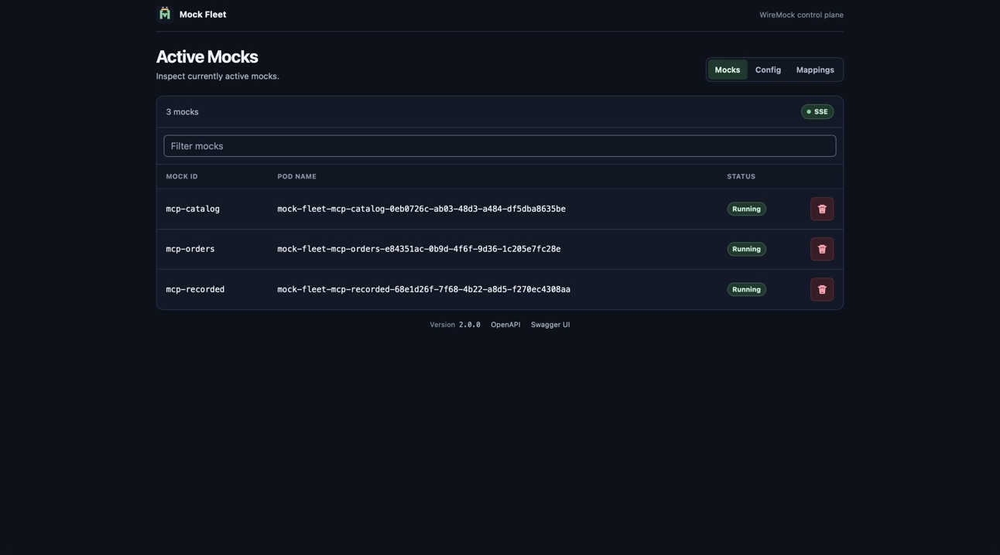
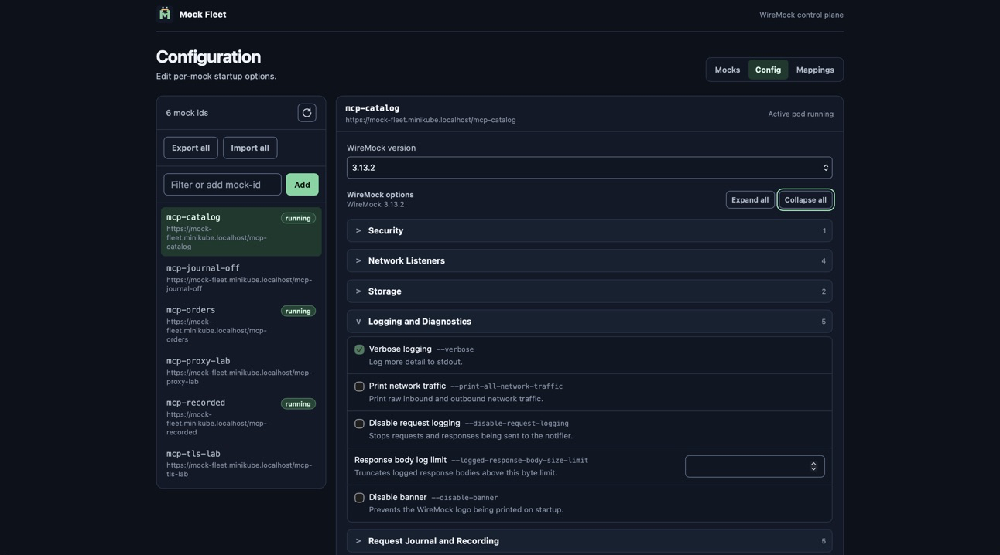
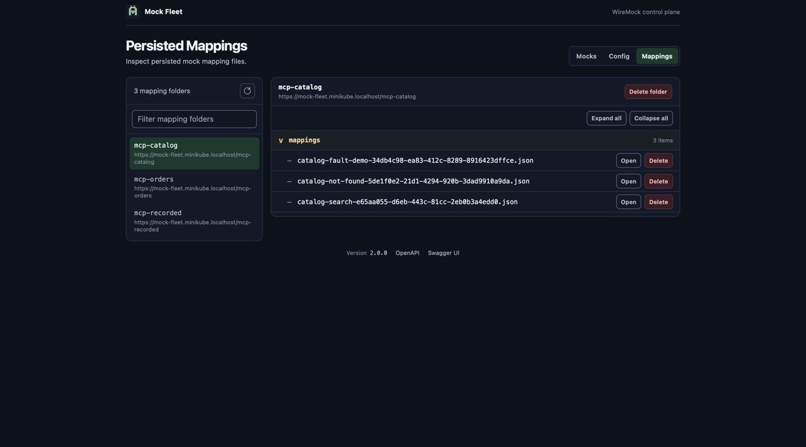

# mock-fleet

`mock-fleet` routes HTTP requests to on-demand WireMock pods in Kubernetes and provides a dashboard and optional MCP server for operating those mocks.

It is deployed as three core services and one optional service:

- `fleet-proxy`: routes incoming mock traffic.
- `fleet-api`: manages WireMock pods, configuration, state, and persisted mappings.
- `fleet-dash`: dashboard served under `/__fleet/`.
- `fleet-mcp`: exposes typed fleet, stub, traffic, recorder, body-file, and scenario tools under `/__fleet/mcp`.

`fleet-mcp` talks only to the internal Fleet API and Fleet Proxy ClusterIP services. It never resolves mock pods or uses pod IPs. Fleet Proxy keeps ownership of resolving or starting a WireMock pod before it forwards an Admin API or mock request.

## Main Functions

### Active Mocks

Inspect currently active mocks.



### Configuration

Edit per-mock startup options.



### Persisted Mappings

Inspect persisted mock mapping files.



## Quick Start

Install the published chart from GHCR:

```bash
helm upgrade --install mock-fleet oci://ghcr.io/letsrokk/charts/mock-fleet \
  --version <version> \
  --namespace mock-fleet \
  --create-namespace
```

Install from this repository:

```bash
helm upgrade --install mock-fleet deploy/helm/mock-fleet \
  --namespace mock-fleet \
  --create-namespace
```

For all chart values and deployment options, see the [Helm chart README](deploy/helm/mock-fleet/README.md).

Enable MCP explicitly:

```bash
helm upgrade --install mock-fleet deploy/helm/mock-fleet \
  --namespace mock-fleet \
  --create-namespace \
  --set ingress.enabled=true \
  --set fleet.mcp.enabled=true
```

The MCP service uses stateful Streamable HTTP and therefore runs one replica. Enabling it requires a pinned WireMock 3.x image; the default is `wiremock/wiremock:3.13.2-2`.

The REST lifecycle is asynchronous and idempotent. `POST /__fleet/api/mocks/{mockId}/start` returns 200 for RUNNING or 202 for STARTING with `retryAfterMs`; poll the same endpoint until RUNNING. DELETE waits for an existing pod to be removed before it returns STOPPED, and also returns STOPPED when the mock is starting, failed, already stopped, or absent. Config rows expose `lifecycle`, and config mutations return `{config,apply:{mockId,mode,lifecycle}}`. All lifecycle/config errors use `ApiError {code,message,retryable,stateMayHaveChanged,details}`; `CONFIG_CONFLICT` includes expected and current versions.

The checked-in [OpenAPI contract](fleet-api/src/main/resources/META-INF/openapi.yaml) documents the exact REST shapes. The running API serves the merged document at `/__fleet/api/openapi?format=json` and Swagger UI at `/__fleet/api/swagger-ui`.

MCP publishes 32 schema-backed tools. It includes `start_mock` and `get_recording_status`; the old `recording_status` name is absent. WireMock tools preflight the lifecycle and return retryable `MOCK_STARTING` while a cold pod starts. Successes use tool-specific structured objects. Failures use `{error:{code,message,retryable,stateMayHaveChanged,details}}` with `isError: true`. Native WireMock JSON stays native, while byte inputs and outputs use `{body:{encoding:utf8|base64,data,sizeBytes}}`.

See the [MCP contract and examples](docs/mcp-contract.md) for tool names, lifecycle polling, config application, body encoding, recording candidates, matched/missed analysis, redaction, SSRF controls, Admin-path guards, and persistent mutation recovery. The [exploratory checklist](docs/exploratory-checklist.md) covers cluster verification.

The existing Fleet Proxy still forwards direct `/__admin` requests from normal mock URLs without authentication. Enabling MCP does not add an authorization boundary to those routes. Protect the ingress at the platform layer when public Admin API access is not acceptable.

For local Minikube development:

```bash
make local-deploy
```

For an example Minikube cluster setup for local deployment and development, see [letsrokk/minikube](https://github.com/letsrokk/minikube).

The local profile uses Traefik, HTTPS, PATH routing, and enables MCP. Run `minikube tunnel` while using the deployment, and trust the Minikube local CA in curl, your browser, and any development JVM. The dashboard is available at `https://mock-fleet.minikube.localhost/__fleet/`; MCP uses `https://mock-fleet.minikube.localhost/__fleet/mcp`; the default WireMock mock is available at `https://mock-fleet.minikube.localhost/wiremock`.

The local lifecycle targets assume that Minikube is already running. Optional Make variables select deployment behavior without adding separate targets:

```bash
make local-deploy LOGS=true
make local-deploy DEV=true                 # API remote development
make local-deploy DEV=proxy
make local-deploy DEV=proxy PORT_FORWARD=true
make local-deploy REBUILD=mcp            # Force one local image rebuild
make local-deploy REBUILD=all            # Force all local image rebuilds
make local-deploy NAMESPACE=test-fleet

make local-destroy
make local-destroy RELEASE=mock-fleet NAMESPACE=test-fleet
make local-destroy DELETE_NAMESPACE=true
```

`DEV=true` and `DEV=api` both select API remote development. Use `DEV=proxy` for proxy remote development. `REBUILD` accepts `dash`, `api`, `proxy`, `mcp`, or `all` and combines the forced rebuild with modules detected from working-tree changes. Run `make help` for the complete target and variable summary.

The full Minikube/SeaweedFS contract suite is opt-in because it creates a namespace, cluster-scoped PV, WireMock pods, and S3 data. Run its static self-test anywhere with `bin/cluster-e2e.sh --self-test`. For a live run, provide the SeaweedFS endpoint and credentials plus the CSI driver and StorageClass described by `bin/cluster-e2e.sh --help`. The script adds a short per-execution suffix to each generated run-specific bucket name, proves the bucket does not exist, creates it, and verifies that it is empty. It then writes the full hidden ownership token to a marker and recursively empties or deletes the bucket only when that marker reads back with the exact token. Existing, forbidden, ambiguous, non-empty, or unowned buckets are never reused or deleted. The script cleans up through a trap and is safe to rerun. GitHub Actions exposes the same suite only through the manual `Cluster E2E` workflow; it is not a push gate.

## License And Copyright

Copyright 2026 letsrokk.

Licensed under the Apache License, Version 2.0. See [LICENSE](LICENSE).
